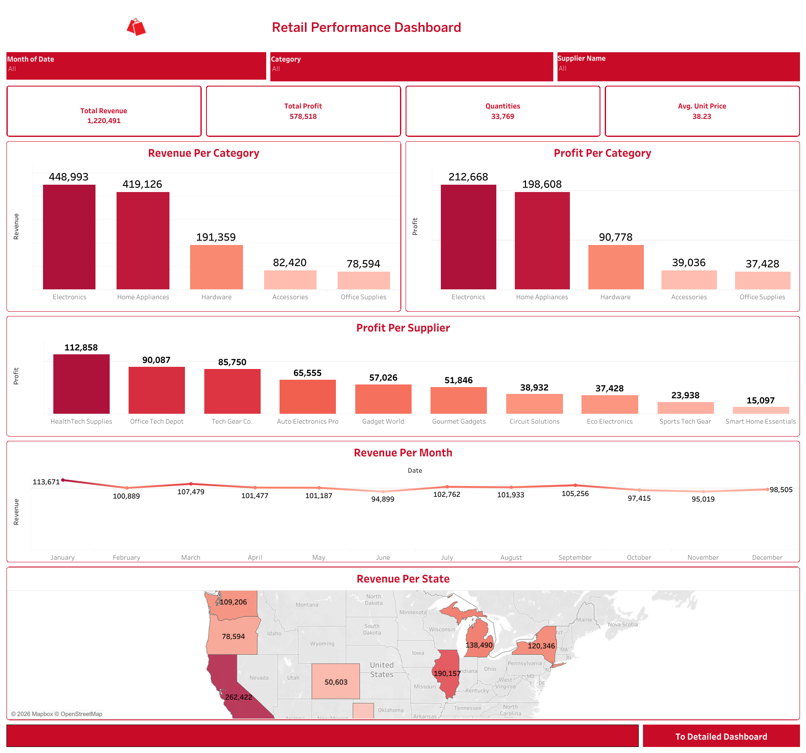
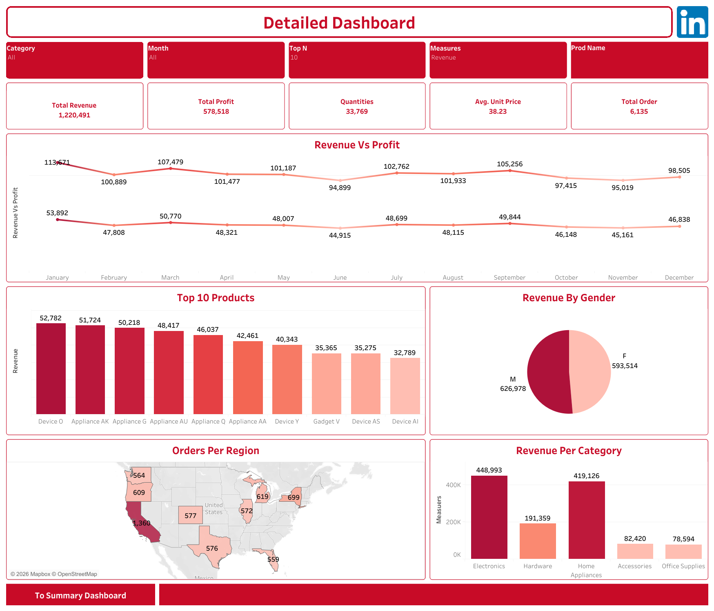

# 🛍️ Retail Performance Dashboard

An interactive **Tableau** dashboard analyzing retail sales performance — revenue, profit, product performance, customer demographics, and regional distribution — built from a raw retail sales dataset.



---

## 📌 Project Overview

This project transforms a raw retail sales dataset into a two-page interactive dashboard that helps stakeholders track KPIs, spot trends, and drill down into product- and region-level performance.

The dashboard is split into two connected views:

- **Summary Dashboard** – high-level KPIs and category/supplier performance
- **Detailed Dashboard** – deeper breakdown with filters, top products, and demographic insights

Both pages are linked with navigation buttons (**To Detailed Dashboard** / **To Summary Dashboard**) for smooth navigation between views.

---

## 🎯 Objectives

- Consolidate raw sales, product, customer, and supplier data into a single clean model
- Track core KPIs: **Total Revenue, Total Profit, Quantities Sold, Avg. Unit Price, Total Orders**
- Identify top-performing products, categories, and suppliers
- Analyze revenue and profit trends across the year (Jan–Dec)
- Understand customer demographics (gender) and regional/state-level distribution
- Enable interactive filtering by **Category, Month, Top N, Measures, Product Name, and Supplier**

---

## 🖼️ Dashboards

### 1. Summary Dashboard
High-level overview of overall retail performance.


**Includes:**
- KPI cards: Total Revenue, Total Profit, Quantities, Avg. Unit Price
- Revenue & Profit per Category (bar charts)
- Profit per Supplier (bar chart)
- Revenue per Month (trend line)
- Revenue per State (map)

### 2. Detailed Dashboard
Deep-dive view with interactive slicers for granular analysis.



**Includes:**
- Slicers: Category, Month, Top N, Measures, Product Name
- KPI cards: Total Revenue, Total Profit, Quantities, Avg. Unit Price, Total Orders
- Revenue vs Profit (monthly trend line)
- Top 10 Products by Revenue
- Revenue by Gender (pie chart)
- Orders per Region (map)
- Revenue per Category (bar chart)

---

## 📊 Dataset

**File:** [`Retail_Data_for_Lab1.xlsx`](Retail_Data_for_Lab1.xlsx)

A single sheet (`Final Product & Sales Data`) combining sales transactions with customer, product, and supplier information — **~6,135 records**.

| Column | Description |
|---|---|
| Customer_ID, Name, Age, Gender | Customer information |
| Region, City, State | Customer/order location |
| Sale_ID, Date, Quantity, Price, Discount | Transaction details |
| Product_ID, Product_Name, Category | Product information |
| Supplier_ID, Supplier_Name, Contact_Person, Contact_Email | Supplier information |
| Cost_Price | Cost basis used to calculate profit |

---

## 🛠️ Tools & Techniques

- **Tableau** – data modeling, calculated fields, and dashboard design
- **Excel** – source data storage
- Calculated fields: Total Revenue, Total Profit, Avg. Unit Price, Quantities, Total Orders
- Interactive filters and dashboard navigation buttons
- Map visuals (Region/State level) for geographic analysis

---

## 📈 Key Insights

- **Electronics** and **Home Appliances** are the top two revenue- and profit-generating categories, far ahead of Hardware, Accessories, and Office Supplies
- Revenue peaked in **January (113,671)** and stayed relatively stable throughout the year, dipping slightly in **June**
- **HealthTech Supplies** is the top supplier by profit contribution
- Revenue is almost evenly split between male and female customers
- **California** leads all states/regions by a wide margin in both revenue and order volume

---

## 📂 Project Structure

```
retail-performance-dashboard/
├── summary-dashboard.png
├── detailed-dashboard.png
├── Retail_Data_for_Lab1.xlsx
└── README.md
```

---

## 🚀 How to Use

1. Clone this repository
2. Open the Tableau `.twbx` workbook (if included) or the source `Retail_Data_for_Lab1.xlsx`
3. Explore the dashboard using the filters (Category, Month, Product Name, etc.)
4. Use the navigation buttons to switch between the Summary and Detailed views

---

## 👤 Author

**Mahmoud Salah Lebda**
📧 mahmoudlebda728@gmail.com
📍 Cairo, Egypt
